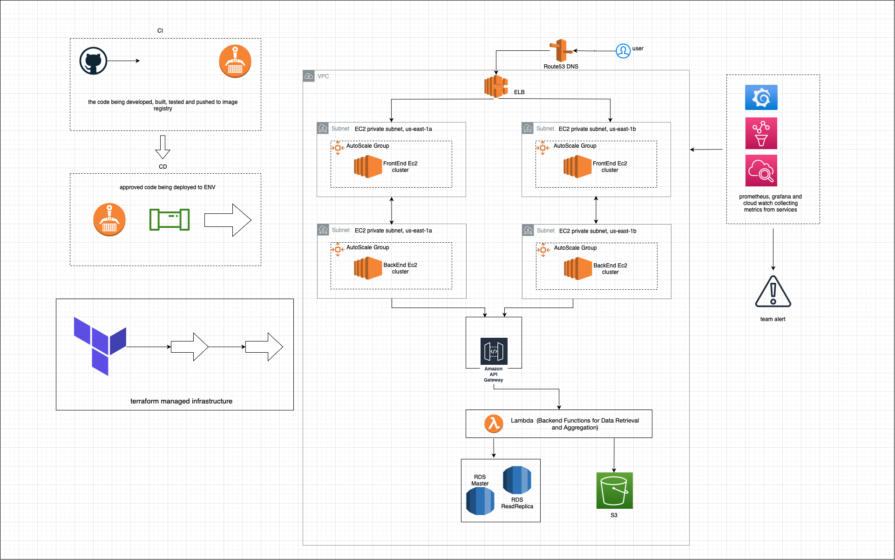

# virga-task

**Accessing Data Stores using a Common Pattern:**

To ensure the application can access any data store using a common pattern, we can utilize AWS Lambda functions as the glue between the application servers and the data stores. Each data store can have a corresponding Lambda function acting as an API gateway for the specific store. The Lambda functions can handle the communication and data retrieval from the respective data stores, abstracting the complexity for the front-end developers. This approach allows for a consistent interface and decouples the application from the data stores.

**Handling Spikes of Heavy Traffic and Scaling Strategies:**

To handle spikes of heavy traffic, we can utilize several AWS services:

- Auto Scaling Groups: 
The application servers can be launched in an Auto Scaling group to handle increased load. The group's scaling policies can be configured to add additional instances based on CPU or request metrics, ensuring the application scales horizontally during peak traffic.

- Elastic Load Balancer (ELB): An ELB can be placed in front of the application servers to distribute incoming traffic evenly across the instances. This helps to improve availability and handle the load during high traffic periods.

- Database Scaling: Depending on the specific data stores used (RDS, DynamoDB, etc.), scaling strategies like read replicas, provisioned capacity, or on-demand scaling can be implemented to handle increased database traffic.

**Monitoring and Maintenance Tools/Processes:**

To ensure availability and quickly identify/address issues, the following tools and processes can be employed:

- Amazon CloudWatch: Monitoring metrics such as CPU utilization, network traffic, and application-level metrics can be captured using CloudWatch. Alarms can be set up to notify administrators when predefined thresholds are breached.
In addition, self hosted Grafana and Prometheus could be to get all metrics and buld custom alert based on that.

- AWS CloudTrail: Logging and auditing of API calls made by the application can be achieved using CloudTrail. This helps in troubleshooting and identifying any unauthorized access or potential issues.

- Terraform: Infrastructure can be defined as code using Terraform, enabling consistent and repeatable deployments. This allows for quick and smooth deployment of new versions while minimizing manual errors.

- AWS Database Migration Service: If data migrations are required during application updates, the Database Migration Service can assist in a smooth transition without downtime.

- Regular Backups: Implement regular backups for the databases using automated backup features available in RDS or DynamoDB, ensuring data durability and enabling point-in-time recovery if needed.